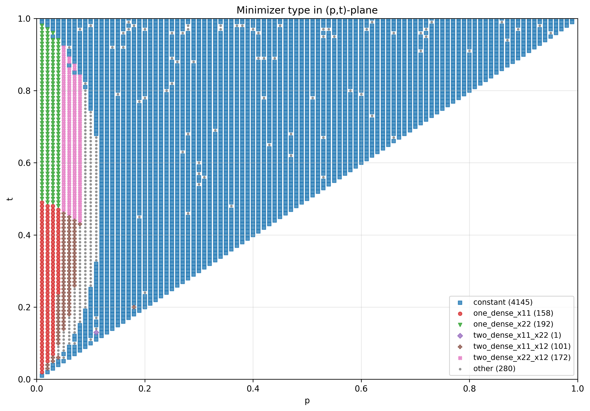
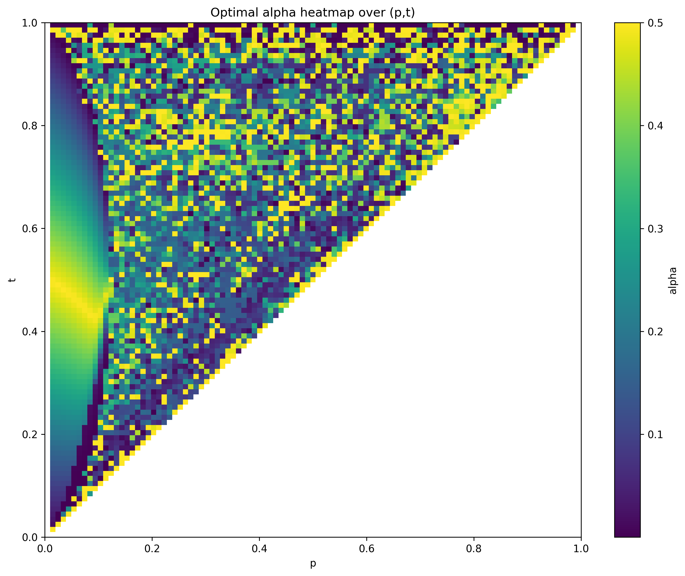
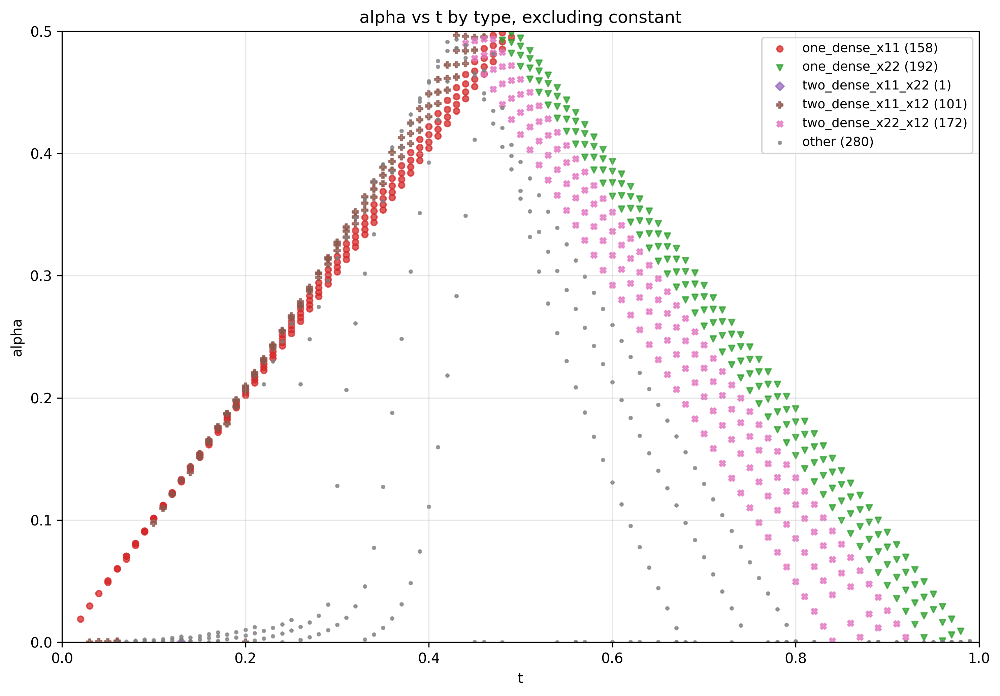

# Graphon Entropy Minimization under Triangle Constraints

This project numerically studies a variational problem arising in the large deviation theory of random graphs. The goal is to understand how a graph deviates from an Erdős–Rényi model with edge density $p$ when conditioned to have an atypically high triangle density. 

The implementation combines nonlinear optimization with visualization, producing both static plots (Matplotlib) and an interactive heatmap (Plotly) for exploring the solution landscape.

---

## Problem Description

Let $p \in (0,1)$ denote the edge density of a reference Erdős–Rényi graph. We consider graphons that produce a higher triangle density, parametrized by $t \in (0,1]$ with the constraint $t \ge p$.

The objective is to determine the structure of graphons that minimize relative entropy with respect to the constant graphon $p$, subject to achieving triangle density at least $t^3$.

---

## Model

We consider a 2-step graphon with:
- block size $\alpha \in (0, \tfrac{1}{2}]$,
- edge probabilities $x = (x_{11}, x_{12}, x_{22}) \in [0,1]^3$.

The objective functional (relative entropy) is:

$$
I_p(\alpha, x_{11}, x_{12}, x_{22}) =
\alpha^2 h_p(x_{11})
+ 2\alpha(1-\alpha) h_p(x_{12})
+ (1-\alpha)^2 h_p(x_{22}),
$$

where

$$
h_p(x) = x \log \frac{x}{p} + (1-x)\log \frac{1-x}{1-p}.
$$

The triangle density is given by:

$$
T(\alpha, x) =
\alpha^3 x_{11}^3
+ 3\alpha^2(1-\alpha) x_{11} x_{12}^2
+ 3\alpha(1-\alpha)^2 x_{12}^2 x_{22}
+ (1-\alpha)^3 x_{22}^3.
$$

---

## Optimization Problem

$$
\begin{aligned}
\min_{\alpha, x_{11}, x_{12}, x_{22}} \quad & I_p(\alpha, x_{11}, x_{12}, x_{22}) \\
\text{subject to} \quad &
T(\alpha, x) \ge t^3, \\
& 0 \le x_{11}, x_{12}, x_{22} \le 1, \\
& 0 < \alpha \le \tfrac{1}{2}.
\end{aligned}
$$

---

## Numerical Method

The optimization is performed using Sequential Least Squares Programming (SLSQP) via `scipy.optimize.minimize`.

To reduce the effect of local minima:
- multiple structured initializations are used;
- additional random initializations are sampled;
- only feasible solutions are retained;
- the best solution (lowest objective value) is selected.

The restriction $\alpha \le \tfrac{1}{2}$ removes symmetry between the two blocks.

---

## Output

For each pair $(p,t)$, the code computes:
- optimal parameters $\alpha, x_{11}, x_{12}, x_{22}$,
- objective value,
- classification of the minimizer.

Results are saved as a CSV file and visualized as phase diagrams.

---

## Visualization

### Minimizer types



### Alpha heatmap



### Alpha vs $t$



---
  
In addition to static plots, the project generates an interactive heatmap of the optimal value of $x_{11}$ over the $(p,t)$ grid:  
  
 file: `results/interactive_x11_heatmap.html`  

  
This visualization allows you to:  
- hover over each point to see $(p,t)$ values,  
- inspect the optimal parameters ($x_{11}$, $\alpha$),  
- investigate the jumps in values 

---
## Installation

```bash
pip install -r requirements.txt
